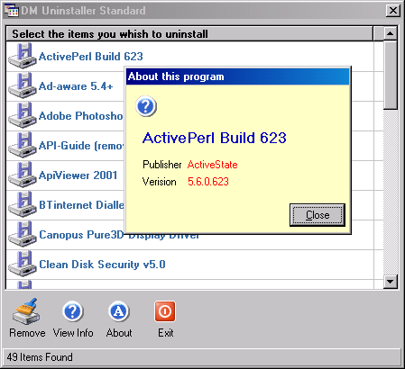



## DM Uninstall Std

### Description

Hi fellow programmers this is a small Program i made to unstall programs from windows at the moment it's only been tested on Windows 2000 but i will be doing a update for other ver's soon.

The reson i made this code I don't know if anyone else finds this problum but the Windows Add/Remove program seem to take it time to load on Win2k real bottle net style. anyway if you like this code please vote.
 
### More Info
 

             |
---                |---
**Submitted On**   |2001-11-21 04:55:50
**By**             |[dreamvb](https://github.com/Planet-Source-Code/PSCIndex/blob/master/ByAuthor/dreamvb.md)
**Level**          |Intermediate
**User Rating**    |5.0 (20 globes from 4 users)
**Compatibility**  |VB 6\.0
**Category**       |[Windows System Services](https://github.com/Planet-Source-Code/PSCIndex/blob/master/ByCategory/windows-system-services__1-35.md)
**World**          |[Visual Basic](https://github.com/Planet-Source-Code/PSCIndex/blob/master/ByWorld/visual-basic.md)
**Archive File**   |[DM\_Uninsta3640611202001\.zip](https://github.com/Planet-Source-Code/dreamvb-dm-uninstall-std__1-29057/archive/master.zip)

